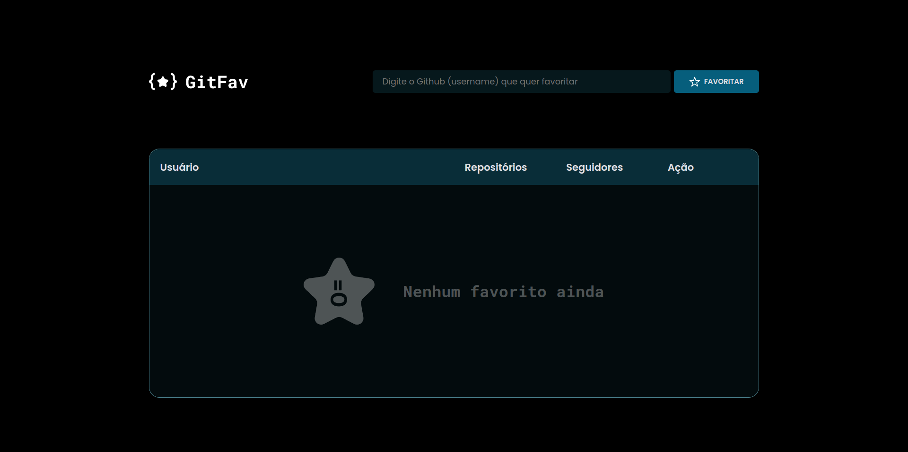
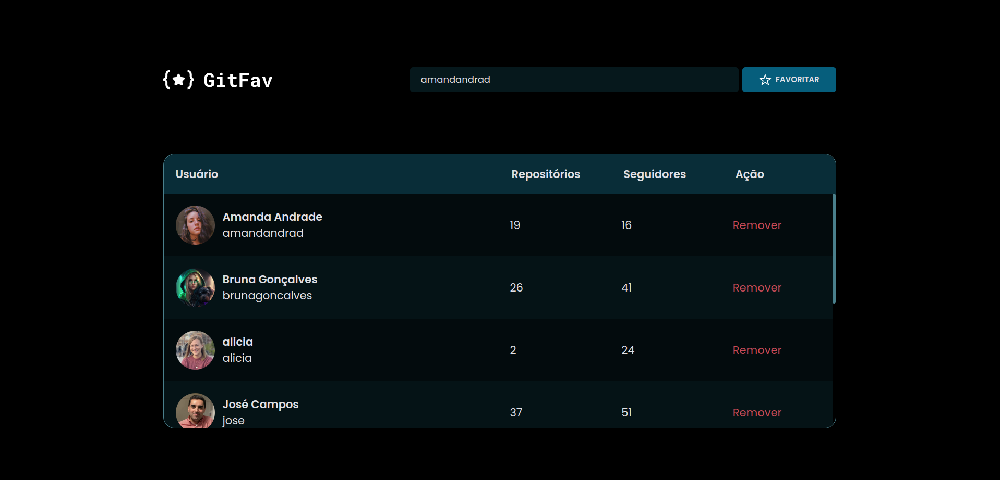

<h1 align="center"> Desafio - GitFav </h1>

Projeto desenvolvido em conjunto durante os estudos do Stage 6 na trilha Explorer da Rocketseat.

  
  

#### Esse projeto foi desenvolvido com as seguintes tecnologias:

- HTML e CSS
- JavaScript
- Git e Github
- Figma

#### Você pode visualizar o layout do projeto através [DESSE LINK](<https://www.figma.com/file/iCsOVJuoGJqjYJmN53IGGp/Explorer-(Copy)?type=design&node-id=0-1&mode=design&t=QKePrdNx74pOzYBq-0>).

